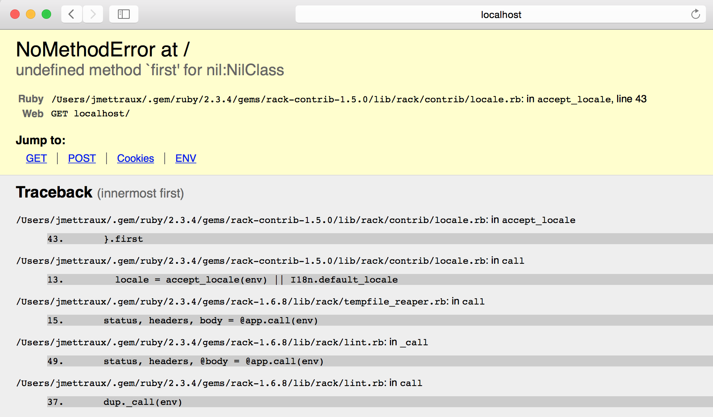

# rack_contrib_locale_issue

A project to expose an issue with rack-contrib/locale and Safari.

* Ruby: `ruby 2.3.4p301 (2017-03-30 revision 58214) [x86_64-darwin14]`
* OS X: `Yosemite 10.10.5 (14F2511)`
* Gems: as per [Gemfile.lock](Gemfile.lock).

* Safari: `Version 10.1.2 (10603.3.8)`
* HTTP_ACCEPT_LANGUAGE (from Safari to app): `"en-us"`

## usage

```
$ git clone https://github.com/jmettraux/rack_contrib_locale_issue`
$ cd rack_contrib_locale_issue/
$ bundle install
$ make s
```

When the server has started, open Safari and navigate to [http://localhost:8080](http://localhost:8080)

It should result in:


As seen from the log:
```
NoMethodError: undefined method `first' for nil:NilClass
	/Users/jmettraux/.gem/ruby/2.3.4/gems/rack-contrib-1.5.0/lib/rack/contrib/locale.rb:43:in `accept_locale'
	/Users/jmettraux/.gem/ruby/2.3.4/gems/rack-contrib-1.5.0/lib/rack/contrib/locale.rb:13:in `call'
	/Users/jmettraux/.gem/ruby/2.3.4/gems/rack-1.6.8/lib/rack/tempfile_reaper.rb:15:in `call'
	/Users/jmettraux/.gem/ruby/2.3.4/gems/rack-1.6.8/lib/rack/lint.rb:49:in `_call'
	/Users/jmettraux/.gem/ruby/2.3.4/gems/rack-1.6.8/lib/rack/lint.rb:37:in `call'
	/Users/jmettraux/.gem/ruby/2.3.4/gems/rack-1.6.8/lib/rack/showexceptions.rb:24:in `call'
	/Users/jmettraux/.gem/ruby/2.3.4/gems/rack-1.6.8/lib/rack/commonlogger.rb:33:in `call'
	/Users/jmettraux/.gem/ruby/2.3.4/gems/rack-1.6.8/lib/rack/chunked.rb:54:in `call'
	/Users/jmettraux/.gem/ruby/2.3.4/gems/rack-1.6.8/lib/rack/content_length.rb:15:in `call'
	/Users/jmettraux/.gem/ruby/2.3.4/gems/rack-1.6.8/lib/rack/handler/webrick.rb:88:in `service'
	/Users/jmettraux/.rubies/ruby-2.3.4/lib/ruby/2.3.0/webrick/httpserver.rb:140:in `service'
	/Users/jmettraux/.rubies/ruby-2.3.4/lib/ruby/2.3.0/webrick/httpserver.rb:96:in `run'
	/Users/jmettraux/.rubies/ruby-2.3.4/lib/ruby/2.3.0/webrick/server.rb:296:in `block in start_thread'
::1 - - [29/Aug/2017:10:57:33 +0900] "GET / HTTP/1.1" 500 45101 0.0108
```

## license

MIT for what it's worth.

